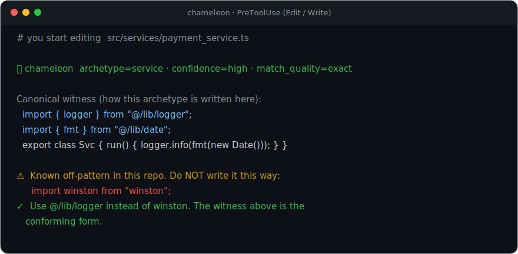

# chameleon

> "Code that blends in."

[](LICENSE)
[](https://docs.claude.com/claude-code)
[](#languages-and-frameworks)
[](#proof-not-promises)
[](https://www.claudepluginhub.com/plugins/crisnahine-chameleon?ref=badge)

**Your AI writes code that works, and it reads wrong. Chameleon shows the model your repo's own conventions at the moment it types, then reviews the turn's diff before you do.**

---

## Watch it work

### 1. Before the first edit, the model sees your repo's actual shape



*Real capture: every line above is the actual output of the PreToolUse hook run against a real TypeScript repo (the archetype, the witness imports, the taught idiom, and the axios counterexample are verbatim, not a mockup).*

A hook injects this on the first touch of each kind of file (an "archetype"). The block is:

- **a real conforming file from your repo** to imitate (the canonical witness, capped at 16,000 chars)
- **your team's idioms** for that kind of file
- **a counterexample**: a real off-pattern line from your own code, labeled "do NOT write it this way" (appears once you teach a competing import)
- **the signatures of the collaborator files** it is about to call, ranked by call proximity
- **the inbound callers** of the file being edited: "change this signature, update these call sites in the same turn"
- **archetype facts**: the base class contract this cohort implements, and the exports that already exist so it reuses instead of re-inventing

Later edits to a seen archetype get a one-line pointer instead, so your context window survives. Zero commands. The hooks do it.

### 2. The diff it exists to kill

Task: "add a fetch to the orders page." Without chameleon:

```ts
import axios from "axios";                 // team standardized on @/lib/http months ago

function formatMoney(cents: number) {      // fmtMoney() already exists in @/lib/format
  return "$" + (cents / 100).toFixed(2);
}
const res = await axios.get(`/api/orders/${id}`);
```

Same task with the witness and the "already defined in this archetype" facts in context:

```ts
import { http } from "@/lib/http";
import { fmtMoney } from "@/lib/format";

const res = await http.get(`/api/orders/${id}`);
```

The first version compiles, passes tests, and dies in review, where you have been catching it by hand every single time. Duplication up and reuse down is AI's biggest measured maintainability regression. Chameleon attacks it twice: at write time (show the wrapper and the existing helper first) and at turn end (a semantic duplication catch grounded in your real call graph: "this already exists, called from 7 sites").

### 3. When the turn ends, a second reviewer reads the diff

```
chameleon turn-end review

CROSS-FILE (deterministic):
  `AuthModule` is no longer exported from src/auth/auth.module.ts,
  but src/app.module.ts:3 still imports it (re-verified live on disk).

CORRECTNESS (diff-only judge):
  src/jobs/sync.ts:27  this turn's refactor dropped the `await` on
  queue.flush(); the process can exit before the flush completes.
```

The cross-file line is a real capture (the `golden-ts-nestjs` fixture with `AuthModule`'s export removed): it is deterministic, from a prebuilt import index plus a live disk probe, for TypeScript, Python, and Ruby. The correctness line is representative, because the judge is a separate `claude -p` spawn whose prose varies per run: it reads only the turn's diff and hunts what static analysis misses (inverted conditions, dropped awaits, missing guards), escalating to a stronger model on high-risk routes. An unaddressed HIGH finding resurfaces exactly once on a later turn, then stops nagging. Advisory by default; it never eats your turn.

### 4. Ask who calls this, before you change it

```
> get_callers  src/auth/auth.service.ts  create

total: 1  (deterministic, from the committed calls index)
  src/auth/auth.controller.ts:18   grade=typed_property   (DI edge)
```

Real output from the bundled `golden-ts-nestjs` fixture, so you can reproduce it exactly. Every returned site is a call the bootstrap actually recorded, graded by how it was resolved (`same_file`, `import`, `constant_receiver`, `typed_property` for a dependency-injection edge, `module_attribute` for Python). `get_blast_radius` walks the same index to the transitive callers a change reaches. The same profile answers the rest of the comprehension surface fully offline: `search_codebase` (functions and classes by name, ranked, with signature and caller count), `get_callees`, `query_symbol_importers`, `describe_codebase`, and `explain_edit`, a post-incident replay of exactly what chameleon knew and did the last time a file was edited. No embeddings service, no network.

---

## Why we built this

We ship a Rails + TypeScript codebase at [Empire Flippers](https://empireflippers.com/), and we review every AI PR that touches it. The failure mode was always the same: the code worked, and it read wrong. `axios` where the team standardized on our HTTP wrapper, a hand-rolled date formatter next to the one we already had, a new service that skipped the base class every other service extends. We wrote CLAUDE.md rules for all of it, and they rotted in a week, because prose about code goes stale the moment the code moves and nobody's job is rewriting the style guide after every refactor. Then we noticed when the model DID conform: exactly when a real file from our repo happened to be sitting in its context. It needs to see one of our files at the moment it writes, not read prose about them. So we built the thing that shows it one, automatically, derived from the repo itself.

That was 175 releases ago. We still run it daily on the code that pays our salaries.

## Why the rule-file approach fails

You have tried this: a conventions section in `CLAUDE.md`, a `.cursorrules`, an `AGENTS.md`. Three structural problems:

1. **You write them.** Nobody enumerates every convention their repo follows. The list is partial on day one.
2. **They rot.** Someone refactors the HTTP wrapper; the rule file still names the old one; the model follows the stale rule with full confidence. Rot is invisible until it bites.
3. **Prose loses.** "Please use our wrapper" competes with everything else in context. A concrete file to imitate is how in-context learning actually works.

Chameleon inverts all three. Conventions are derived by parsing the code itself: the official TypeScript Compiler API for TS/JS, Prism for Ruby, bundled libcst for Python. The profile derives from the production branch tip through a clean git worktree, never your dirty checkout, so a half-finished experiment cannot poison the team's norms. It refreshes automatically on drift. The rules cannot rot, because they are recomputed from the thing they describe.

## Each failure, mapped to the mechanism that kills it

| The failure | The mechanism | When it fires |
|---|---|---|
| `axios` instead of `@/lib/http` | The canonical witness already imports the wrapper; teach the rule once and every later edit also gets the counterexample quoted from your own repo | Before the edit |
| The second `formatDate` | Turn-end semantic duplication catch, grounded in the real call graph; `search_codebase` finds the original first | Turn end |
| Rename breaks 7 callers | Inbound-callers block before the edit; contract-break and removed-export checks against a prebuilt import index at turn end; `get_blast_radius` for the transitive picture | Before and after |
| Hardcoded `sk_live_` key | Deterministic write-time block (AWS `AKIA`, GitHub `ghp_`, Anthropic `sk-ant-`, Stripe `sk_live_`, Slack, Google, PEM keys, more), even on brand-new files; same for error-severity `eval`/`exec` | At write, always |
| Hallucinated dependency | A don't-invent-dependencies protocol in context; phantom-import probes against the live disk; a deterministic dependency diff scan in PR review. About 1 in 5 AI-recommended packages do not exist, and attackers pre-register the recurring fake names | Write time and PR review |
| The three-hour review loop | A turn-end correctness judge reads the diff in the same minute it was written; `/chameleon-pr-review` runs the mechanical review rounds before a human opens the PR | Turn end and pre-review |

---

## The full surface

Six hooks across six lifecycle events, 19 MCP tools (16 comprehension/conformance + 3 operator dispatchers), 15 skills. You will call almost none of it directly; it works behind two moments, before the model writes and after the turn ends.

| When | What runs |
|---|---|
| Session start | One-time convention summary + team principles for the repo |
| Before each edit | Archetype resolve + the injection above; deterministic deny on hard-kind secrets and error-severity eval/exec, even on brand-new files |
| After each edit (x2) | Record the observation, then verify against the archetype's calibrated rules |
| On your prompt | Intent capture: checkable assertion tokens (secret-scanned digests, never your raw prose) that sharpen the turn-end judge |
| Turn end | Correctness judge, duplication vs call graph, cross-file existence, stale-test and co-change advisories (Django model without a migration, Rails controller without a route, NestJS controller not registered in a module, Redux slice never added to the store), test-integrity facts, finding ledger, once-per-session idiom self-review |
| On demand | 14 slash commands + the comprehension and review tool surface |

**Enforcement earns the right to block.** A convention rule blocks only after it is calibrated: measured near-zero false positives against your repo's own committed files. Rules your team overrides get auto-demoted back to advisory. Modes are `off` / `shadow` / `enforce`; shadow logs what would have blocked, and `/chameleon-status --shadow` shows you the evidence before you turn enforcement on. Inline escape hatch: `// chameleon-ignore <rule>` (`#` in Ruby/Python). The only unconditional blocks are facts nobody argues with: leaked credentials and error-severity eval/exec, at write time. Kill switches exist for everything.

**Cross-file work is indexed ahead of time.** A reverse import index and a calls index with five deterministic edge grades (`same_file`, `import`, `constant_receiver`, `typed_property` for TS dependency injection, `module_attribute` for Python) power contract-break detection (you narrowed positional params a committed caller still passes), transitive blast radius, phantom imports, and removed-export-breaks-importers. Monorepos are first-class: per-workspace profiles (pnpm / yarn / turbo / nx / lerna, plus plain `apps/` `packages/` `services/` layouts), a cross-workspace existence index for the break a per-package view cannot see, and a multi-root turn-end backstop covering every workspace the session touched, even from a coordinator root with no profile of its own.

**Two review skills, built to kill their own findings.** `/chameleon-pr-review` runs a multi-round, hunk-gated review: deterministic BLOCKs for secrets and eval, a dependency supply-chain diff scan (install scripts, non-registry sources, typosquat acknowledgment, minified and packed manifest evasion), Rails migration safety, coverage delta, an auto-pass routing verdict with a complexity tier, and an independent round-3 refuter that attacks each finding before you ever see it. Verdicts land in a signed review ledger. `/chameleon-receiving-code-review` does the reverse: it verifies a teammate's review against the actual code before you apply it, so you push back with evidence instead of performative agreement.

**Teach what parsers can't see.** `/chameleon-teach` captures rules like "use our wrapper, never raw fetch"; from then on the model also sees a counterexample quoted from your own off-pattern code. `/chameleon-auto-idiom` mines idioms from the repo with occurrence evidence and proposes them for approval. A prose miner reads your CONTRIBUTING / STYLE docs and proposes only the rules your code already backs.

---

## Languages and frameworks

| Language | Parser | Deeper awareness |
|---|---|---|
| TypeScript / JavaScript (`.ts` `.tsx` `.js` `.jsx` `.mjs` `.cjs`) | official TypeScript Compiler API | Next.js, NestJS |
| Ruby | Prism | Rails |
| Python | libcst (bundled, nothing to install) | Django, DRF, Flask, FastAPI |

Framework-agnostic by default: chameleon learns your repo's own conventions, so any framework works. The named ones get extra structural understanding where their conventions are strong. Nothing else is supported today. No Go, Rust, or Java.

---

## Install

Needs `uv` and Node 20+ on PATH. Ruby repos need Ruby with Prism; Python repos need nothing extra.

```
/plugin marketplace add crisnahine/chameleon
/plugin install chameleon@chameleon
```

Restart Claude Code, then in the repo you care about:

```
/chameleon-init     # parse the repo, derive conventions
/chameleon-trust    # review the profile, approve it for this machine
```

Done. Every edit from here gets the injection automatically. Version matrix and troubleshooting: [docs/install.md](docs/install.md).

## Usage examples

Day to day you type almost nothing: the hooks inject context before each edit and review each turn on their own. These are the moments you actually reach for a command.

**Teach the rule a parser can't infer.** One plain sentence is enough. A "use X, not Y" import rule becomes a convention the lint engine checks, and as long as the discouraged form still exists somewhere in your repo, later edits also see it quoted as a "do NOT write it this way" counterexample:

```
/chameleon-teach import our http wrapper from @/lib/http, never raw axios
```

The structured form, when you want exact control over the captured idiom:

```
/chameleon-teach
slug: use-http-wrapper
rationale: Retries, auth headers, and error normalization live in the wrapper.
example: import { http } from "@/lib/http";
counterexample: import axios from "axios";
```

**Ask the codebase before you change it.** Plain-English questions route to the comprehension tools, answered offline from the committed index:

```
where is invoice pricing calculated?       # search_codebase: ranked symbols, signature + caller count
who calls create() in auth.service.ts?     # get_callers: deterministic, graded call edges
what breaks if I narrow this signature?    # get_blast_radius: the transitive callers a change reaches
```

**Review the branch before a human does:**

```
/chameleon-pr-review                  # current branch vs the locked production base (or main)
/chameleon-pr-review PROJ-1234        # also check the diff against the ticket's requirements
/chameleon-pr-review <PR-URL>         # review a teammate's PR the same way
```

**Replay an incident.** A bug shipped through a file chameleon watches; see what it knew, what it injected, and why the gate stayed silent the last time that file was edited:

```
/chameleon-explain src/billing/invoice.service.ts
```

**Override a block inline, and it's audited.** An intentional deviation is one trailing comment (`#` in Ruby and Python). Rules your team keeps overriding get auto-demoted back to advisory:

```ts
import axios from "axios"; // chameleon-ignore import-preference-violation
```

## Commands

| Command | What it does |
|---|---|
| `/chameleon-init` | Parse the repo, build the profile |
| `/chameleon-trust` | Approve a profile for use on this machine |
| `/chameleon-refresh` | Re-derive from the production branch tip after drift |
| `/chameleon-status` | Profile health, drift, enforcement mode, shadow evidence |
| `/chameleon-teach` | Capture a rule AST can't infer (banned import, mandatory wrapper) |
| `/chameleon-auto-idiom` | Mine team idioms from the repo, evidence-backed |
| `/chameleon-pr-review` | Multi-round PR / branch review with a round-3 refuter |
| `/chameleon-receiving-code-review` | Verify a teammate's review against the code before applying it |
| `/chameleon-explain` | Drill into one rule, or replay what chameleon knew when a file was edited |
| `/chameleon-deep-work` | Execute a task with the deep-work discipline: dig to full understanding with hired parallel experts, no questions, then implement in a worktree |
| `/chameleon-doctor` | Installation health triage |
| `/chameleon-journey` | End-to-end release verification harness |
| `/chameleon-disable` | Off for this session |
| `/chameleon-pause-15m` | Off for 15 minutes |

---

## The tradeoffs, straight

1. **It costs tokens and latency per turn.** Injecting a witness file and spawning a turn-end judge is not free. If your edits are tiny and your repo has no conventions worth keeping, leave it off.
2. **Three languages.** TypeScript/JavaScript, Ruby, Python. If your repo is something else, this isn't for you yet.
3. **It catches a slice, not the ceiling.** Roughly 45% of AI-generated code ships an OWASP Top 10 vulnerability regardless of model or tooling (Veracode, 2026). Chameleon blocks secrets and eval deterministically and its judge catches a real but bounded set of logic bugs. It is not a SAST and won't pretend to be one.
4. **No made-up efficacy number.** We will not print "writes better code by X%". We ship the measuring instrument instead: an effectiveness harness that runs paired Claude sessions, context off vs on, and reports the delta. Reproducible for about $3-5 at the ci tier:

```bash
PYTHONPATH=. plugin/mcp/.venv/bin/python -m tests.effectiveness.runner --tier ci --arms off,shadow
```

We'd rather you measure than take our word.

---

## Your code stays your code

- **The per-edit hot path is 100% offline.** No telemetry, ever. Everything chameleon learns lives in `.chameleon/` in the repo and `~/.local/share/chameleon/`.
- **No repo code execution by default.** Parsing is static. Running your `tsc`, your tests, or `npm audit` are separate opt-in env flags; `tsc` and the test runner resolve only from your repo's own `node_modules/.bin`, never PATH (the opt-in dependency audit shells the `npm` already on your PATH; it never downloads a tool).
- **Default network is exactly two things:** a bounded `git fetch` of your own production branch at refresh time (kill switch: `CHAMELEON_FETCH_PRODUCTION_REF=0`), and a once-per-plugin-version `npm ci` of chameleon's own pinned parser into `~/.local/share/chameleon`.
- **A committed profile is inert until you `/chameleon-trust` it.** Clone a repo with a `.chameleon/` someone else committed and nothing injects until you approve it. Profile prose is injection- and secret-scanned at trust time and again at read time. Repo-derived content is wrapped as data to imitate, never as instructions to follow.
- Want it gone: `/chameleon-pause-15m`, `/chameleon-disable`, or `CHAMELEON_DISABLE=1`.

---

## Proof, not promises

Every number below is checkable in this repo right now:

| What | Count | Verify yourself |
|---|---|---|
| Unit tests | **5,311** | `PYTHONPATH=. plugin/mcp/.venv/bin/python -m pytest tests/unit/ --co -q` |
| Released versions | **182** (v0.1.1 to v2.69.0) | `git tag \| wc -l` |
| Changelog | **6,500+ lines** | `wc -l CHANGELOG.md` |
| CI | ubuntu + macos + **native Windows**, Python 3.11-3.13 | [.github/workflows/ci.yml](.github/workflows/ci.yml) |
| Per-edit hot path | benchmarked cold/warm p50 and p99 | `PYTHONPATH=. plugin/mcp/.venv/bin/python tests/bench_hot_path.py` |
| Effectiveness harness | paired off-vs-on sessions | `PYTHONPATH=. plugin/mcp/.venv/bin/python -m tests.effectiveness.runner --list` |

Beyond unit tests: real-repo QA batteries per language, hook fuzzing against malformed payloads, and a journey harness that drives real `claude -p` editing sessions against seed fixtures before each release. Profile writes are atomic transactions, `.chameleon` merge conflicts get a dedicated git merge driver, the statusline stays under 100ms, and a warm-path advisor daemon keeps per-edit latency in milliseconds.

---

## Who builds this

Built by [Cris Nahine](https://github.com/crisnahine) and [Daniel Lisboa](https://github.com/danlisb), dogfooded daily at [Empire Flippers](https://empireflippers.com/) on the code that runs the business. We depend on it; rough edges get found and fixed fast.

Architecture and internals: [docs/architecture.md](docs/architecture.md). Docs index: [docs/README.md](docs/README.md). MIT licensed.
