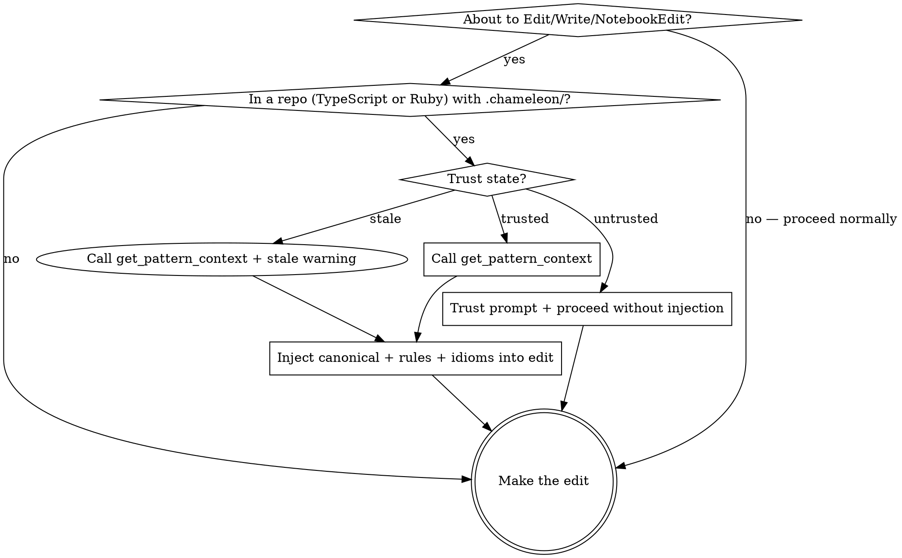

<chameleon-context>
You are working in a repo with a `chameleon` profile. The profile captures the team's archetypes, canonical patterns, and idioms. Generated code that ignores the profile will be flagged by reviewers and require rework.

This skill's rule applies to **every Edit, Write, and NotebookEdit operation** in this repo, regardless of how trivial the change appears.
</chameleon-context>

<SUBAGENT-STOP>
If you were dispatched as a subagent to execute a specific task, skip this skill — your parent has already established the pattern context.
</SUBAGENT-STOP>

# Using chameleon

## The Rule

**Before any Edit / Write / NotebookEdit in this repo, invoke `chameleon-mcp::get_pattern_context(file_path)`.** Use the returned archetype, canonical excerpt, rules, and idioms to shape your output.

Trust state handling:
- `trust_state == "untrusted"` (no trust record exists): surface the trust prompt to your human partner once, then proceed without injection until they run `/chameleon-trust`.
- `trust_state == "stale"` (trust record exists but profile changed): inject content with a stale-trust warning. Suggest re-running `/chameleon-trust`.
- `trust_state == "trusted"`: inject canonical + rules + idioms normally.

If the call fails (timeout, MCP unavailable, parse error): **fail open**. Make the edit using your best inference, but tell your human partner the call failed.

## Coordination with other skills

- Chameleon is an *output-layer* advisory: archetype + canonical + rules + idioms shape the code you write.
- Process-gating skills (e.g. brainstorming, planning, TDD frameworks) run BEFORE chameleon's advisory if both fire on the same Edit. Process gates take priority — finish the brainstorm/plan first, then apply chameleon's pattern context to the actual write.

## Post-edit verification

Chameleon may provide post-edit feedback via `additionalContext` after Edit/Write/NotebookEdit. If you see a `[chameleon: post-edit verification]` block listing archetype violations, fix them in your next edit. Call `get_pattern_context` to see the canonical if you need guidance.

## Red Flags — STOP and call MCP

These thoughts mean you're rationalizing past the rule:

| Thought | Reality |
|---------|---------|
| "This is just a one-line fix" | Pattern conformance applies to one-line fixes too. Call MCP. |
| "It's just a rename" | Naming conventions are an archetype concern. Call MCP. |
| "It's just a comment edit" | Comment style is in the team's canonical. Call MCP. |
| "I just need to reorder imports" | Import order is enforced by the team's perfectionist plugin. Call MCP. |
| "I already saw the canonical this session" | Profiles can drift mid-session if `/chameleon-refresh` runs. Re-call MCP. |
| "The user is in a hurry, skipping saves time" | The MCP call is fast (< 1s typical). Call MCP. |
| "I know this codebase already" | The profile is the source of truth, not your prior. Call MCP. |
| "This file is too unique for the canonical to apply" | If it's truly unique, MCP returns `archetype: null` and you proceed normally. Call MCP. |
| "MCP is broken anyway" | Call MCP; if it actually fails, you'll fail open. Don't preempt. |

## Process flow

## Available slash commands

| Command | Purpose |
|---------|---------|
| `/chameleon-init` (`/cham-init`) | Bootstrap a new profile (≤3-prompt interview) |
| `/chameleon-refresh` (`/cham-refresh`) | Re-analyze repo, update profile after drift |
| `/chameleon-status` (`/cham-status`) | View profile state, drift, value attribution |
| `/chameleon-teach` (`/cham-teach`) | Capture a missed pattern as an idiom |
| `/chameleon-trust` (`/cham-trust`) | Approve a committed profile for this user |
| `/chameleon-disable` (`/cham-disable`) | Disable for the rest of this session |
| `/chameleon-pause-15m` (`/cham-pause-15m`) | Pause for 15 minutes |
| `/chameleon-doctor` (`/cham-doctor`) | Run health checks on the installation |
| `/chameleon-journey` (`/cham-journey`) | Run the end-to-end journey test harness |

## Common rationalizations and counters

| Rationalization | Counter |
|---|---|
| "I'll just batch the MCP calls at the end" | Each edit needs the canonical context BEFORE you write. End-of-batch is too late. |
| "The canonical doesn't fit this exact case" | The canonical is a witness, not a template. Use the *normative shape* (the AST query) and *normative idioms* (the prose annotations), not the witness's idiosyncrasies. |
| "Calling MCP for trivial edits seems wasteful" | If the edit is truly trivial, MCP returns instantly with the canonical. Cost is < 1¢ per call. |
| "This file isn't in any archetype" | Then MCP returns `archetype: null`; you proceed without injection. The call confirms the absence; without the call, you're guessing. |

## Your human partner trusts the profile

Your human partner committed `.chameleon/profile.json` to their repo deliberately. They want generated code to match it. If you bypass the rule "to save time" or because you "already know the patterns," you're overriding their explicit choice with your inference. That's not helpful — that's making them re-do the review.

When the profile and your inference disagree, the profile wins. Always.
